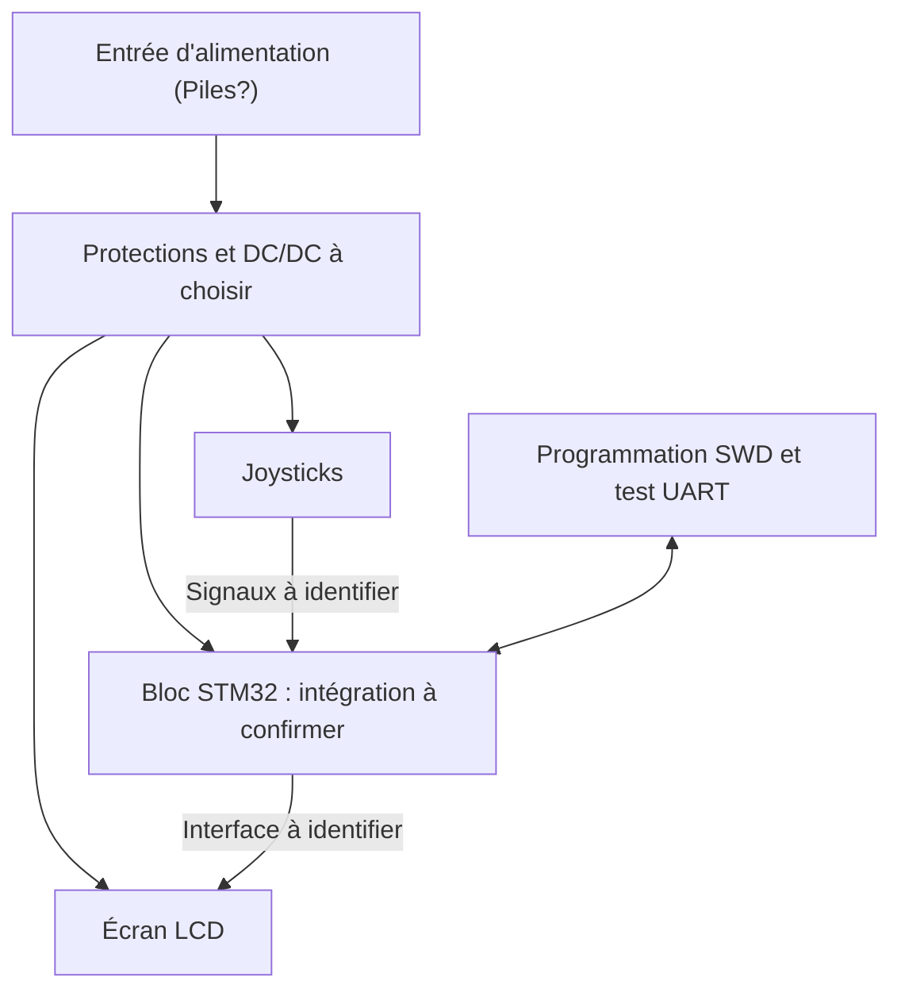

# Architecture à compléter — mini-console

**Version de préparation, sans brochage validé.** Ouvrir [MiniConsole_a_completer.drawio](MiniConsole_a_completer.drawio) dans Draw.io pour modifier les blocs. Le fichier `ArchitectureHW.drawio` du professeur est conservé comme référence.

Les flèches sans texte représentent l'alimentation. Les autres représentent des liaisons logiques, pas un schéma électrique complet. Ajouter masses communes, tensions et signaux précis au schéma KiCad après vérification. Les LED et boutons de test du socle commun sont inclus dans le bloc STM32 et doivent être détaillés dans le schéma.

## Implantation souhaitée

- En haut : écran LCD, avec dégagement pour sa zone visible et son connecteur.
- En bas : joysticks, avec espace pour leur course et l'accès des doigts.
- À répartir : STM32 ou connecteurs de sa carte, alimentation et connecteurs de programmation/test.
- Dimensions, fixation et position de chaque module : à mesurer avant placement définitif.

## À compléter dans les blocs

1. Écran : référence, tension, interface, dimensions et connecteur.
2. Joysticks : quantité, référence, axes/boutons, tension et connecteur.
3. STM32 : référence et décision MCU direct / carte porteuse.
4. Alimentation : source, tension d'entrée, tensions de sortie et courant requis.
5. Développement : connecteurs et signaux SWD/UART effectivement utilisés.

Les cases et flèches ne fixent aucun numéro de broche. Utiliser ensuite la [table de connexions](../11-Pin-Out%20MCU/Connexions_a_completer.md).
